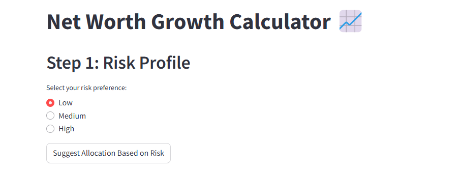
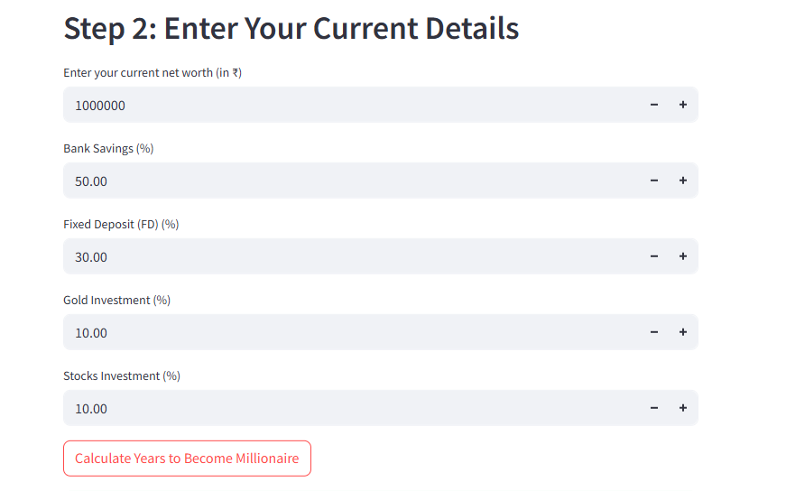

# 📈 Net Worth Growth Calculator

A simple and interactive Streamlit app that helps you estimate how many years it will take to become a millionaire based on your current net worth and investment allocations.

---
## Demo
<h2>Homepage</h2>


<h2>Example 1</h2>


<h2>Example 2</h2>


## ✨ Features
- Risk-based investment allocation suggestions (Low, Medium, High)
- Customizable allocation percentages
- Simulates yearly growth using realistic return rates
- Simple and interactive UI

---

## 🚀 How to Run

1. Clone this repository.
2.Make sure you have **Python** installed.  
3.Install **Streamlit** if you haven't already.

```bash
pip install streamlit
  

